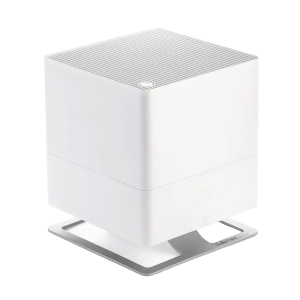
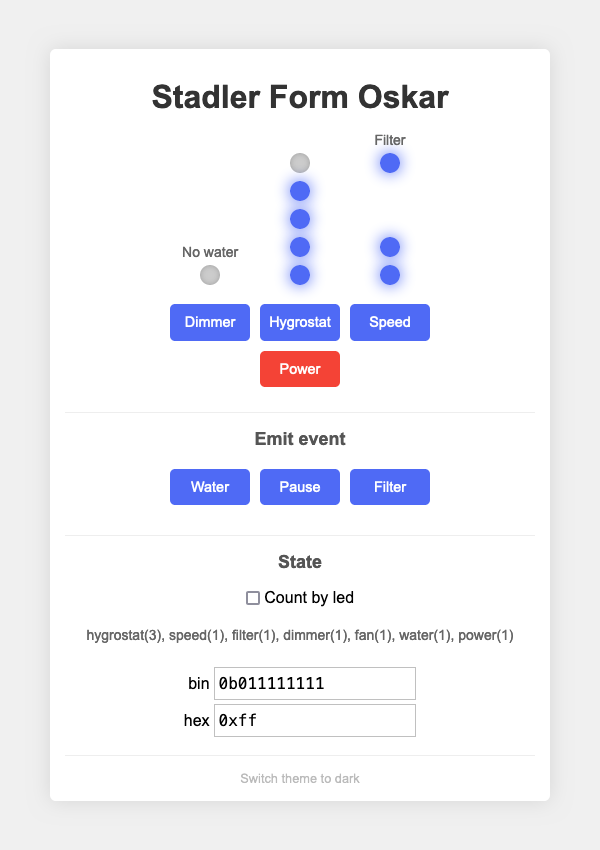
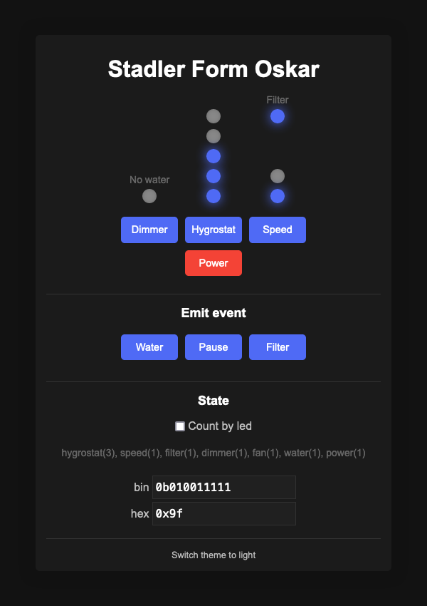

# Stadler form Oskar

<p align="center">



</p>

Research & development project that provides 
[Stadler form Oskar](https://www.stadlerform.com/en/humidifier/oskar-white-o-020) humidifier device simulator.

### Purpose

The simulation of the device's operation aims to provide a comparable environment,
primarily for educational, learning, and analytical purposes.

It is intended for further DIY development of remote device access and integration
into the smart home systems.

## Web-application

Live demo: <https://development.md.land/web-application/stadler-form-oskar-simulator/>

<p align="center">




</p>

### Run

To build web-application static assets, run:

```sh
yarn run build
```

To automatic static assets rebuild, run:

```sh
yarn run dev
```

### Run with docker

```sh
# production run
docker compose up

# development run
docker compose -f ./compose.yaml -f compose.dev.yaml up
```

Then web-application should be accessible at <http://localhost:8119>

<details>
  <summary>Change web-server port:</summary>

Change `HTTP_PORT` environment variable in `.env` or override it on docker launch:

```sh
HTTP_PORT=8042 docker compose up
```

</details>

### Features

- BEM
- TypeScript / Sass (SCSS)
- Yarn / Gulp

## [License (MIT)](license.md)
